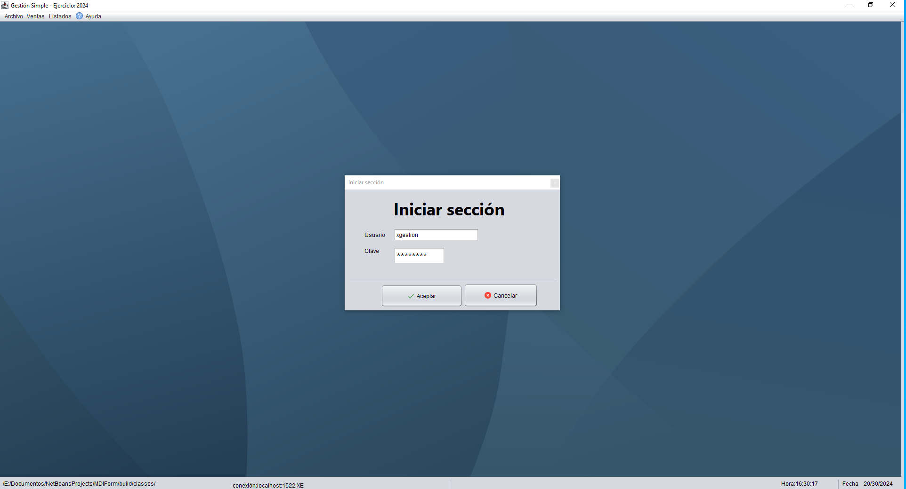

# jGestion
**** Programa de gestión de clientes y facturas ****
- Programado en JAVA (Frontend) con Netbeens 2024
- El Backend del proyecto es con Oracle 21c.
- Para que funcione necesitas descargar el script SQL y montarlo en el servidor que contiene Oracle.
  

